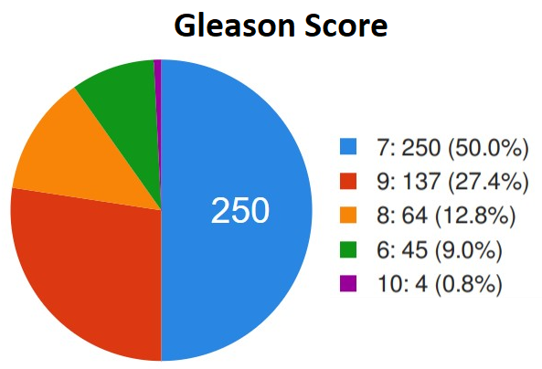

# Prostate Cancer Feature Prediction
Making feature predictions on prostate cancer data, using DNA-methylation and RNA-sequencing data available on cBioPortal. Target features predicted are the Gleason Score, pathological tumor-stage and biomedical tumor recurrence.

# Environment and Libraries
The code is implemented in Python 3 with the help of the following modules - 
    1. Pandas
    2. Sci-kit Learn
    3. Imblearn
    4. Matplotlib
    5. Mpl_toolkits
    6. Pprint

All packages can be installed using `pip install <package_name>`

# Files
There are two files in the repository - `prostate_cancer.py` and `feature_processing.py`. The prostate_cancer file is the main file where execution begins and the feature_processing file contains the separate pipelines used for each of the three target features.

# Background 
Prostate Cancer is a carcinogenic disease affecting the prostate gland in men. It is one of the leading causes of male death worldwide. When compared to other types of cancer, prostate cancer is slightly more unusual due to the fact that it grows extremely slowly and may not show symptoms for several years. It is therefore something that often manages to slip under the radar. Although, tackling this issue is out of the scope of this project, the implementation aims to improve the detection of prostate cancer once the patient's data has been collected i.e. there is at least some doubt that the person may suffer from this cancer. This implementation uses DNA and RNA data avaliable at [cBioPortal](https://www.cbioportal.org/study/summary?id=prad_tcga). 

# Data
The implementation uses two main datasets - data collected from the methylation tests done on the patient DNA and the RNA sequencing data. It also uses a third dataset which contains the clinical records of the patient (the patient's file at the hospital). The clinical records contain lots of general information as well as the three target features for every patient. The DNA and RNA data is used to make predictions on the target features. 

The distribution of values in the target features, is captured in the following pie-charts - 

# Implementation Details
To run the program you will need to download the datafiles [here]. There are two download links on the page, on the top-left for the DNA and RNA data ([direct download link](http://download.cbioportal.org/prad_tcga.tar.gz)) and the top-right for the clinical data. Once downloaded, you will have to change the filepath variable in the `prostate_cancer.py` to the path of the extracted data.

Right at the top of the main function in `prostate_cancer.py`, the control variable `mode` determines how much text is output when the program is run. The default setting is on partial but setting `mode` to show paints a picture of the data as it is modified and updated step-by-step.

Running the code will open up four plots, three of which are interactive 3D plots showing the spread of the target feature values with respect to the DNA data.

The Machine Learning Pipeline used is as follows - 
    1. Feature selection (select k-best, variance thresholding, select from model, chi-square test)
    2. Resampling / Upsampling / Downsampling data for imbalanced dataset.
    3. Dimensionality reduction (PCA, LDA - both can be toggled on or off in `feature_processing.py`)
    4. Classification (SVM, Random Forest, Naïve Bayes', K-Nearest Neighbors)

# Notes 
Machine learning is a quickly expanding field and is useful in several unrelated domains including health and medicine. There are many things that must be considered before we start trusting machines with lives. In addition to moral dilemmas there are also legal and societal aspects that have to be figured out. Still, this is no reason to refuse intelligent machines, especially since they have the potential to be more effecient than humans for certain tasks in domains like medicine.